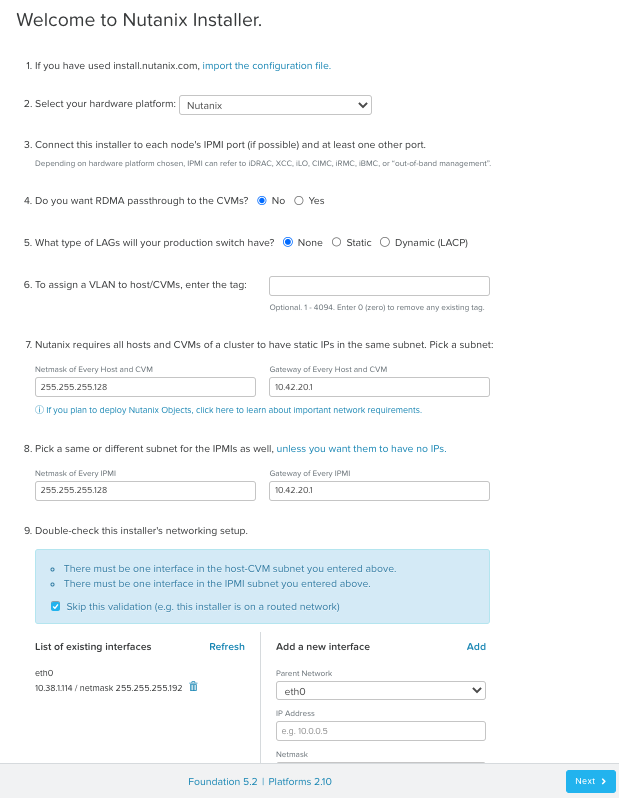
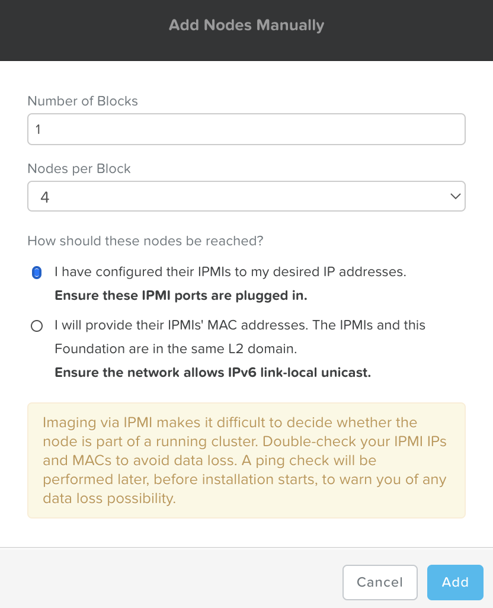
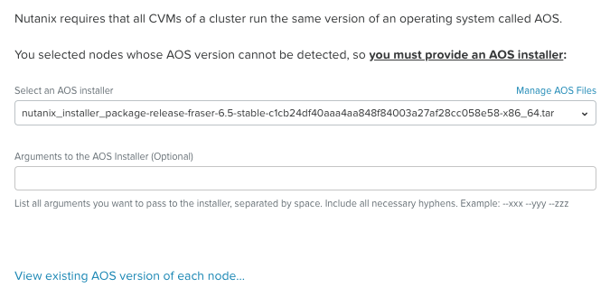
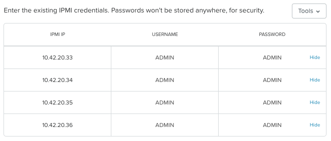
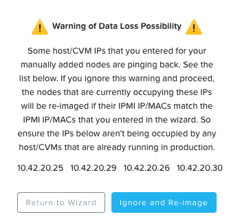
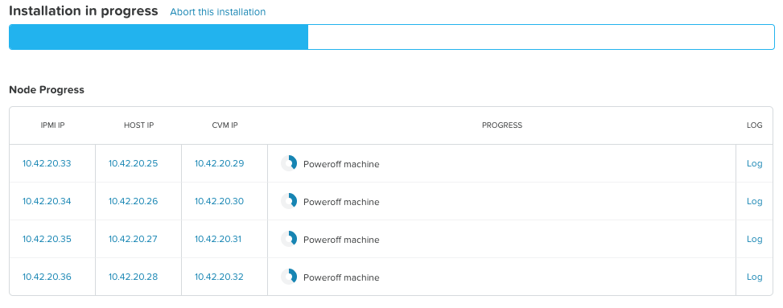

import Tabs from '@theme/Tabs';
import TabItem from '@theme/TabItem';

# Nutanix Foundation 

## Overview

:::info
Estimated time to complete: **60 Minutes**
:::

Foundation is used to automate the installation of the hypervisor and
Controller VM on one or more nodes. In this exercise you will practice
imaging a physical cluster with Foundation. In order to keep the lab
self-contained, you will create a single node cluster on which you
will deploy your Foundation VM. That Foundation instance will be used to
image and create a cluster from the remaining 3 nodes in the Block.

:::caution
In following steps, you should replace xx part of the IP octet with your assigned cluster ID
:::

## Pre-requisites

Your instructor will provide you the following details: collect all these details and note them down somewhere before beginning your lab. 

- Your 4 node cluster details:

  - [ ] 4 x CVM IP addresses 
  - [ ] 4 x Host IP addresses
  - [ ] 4 x IPMI IP addresses
  - [ ] Credentials to access CVM 
  - [ ] Credentials to access IPMI
  
- [ ] 1 x Foundation VM IP address
- [ ] Credentials to access to Foundation VM (ssh and Web UI)
- [ ] Credentials for your cluster access
- [ ] DNS IP Addresses
- [ ] public NTP hostnames 
  

## DIY Environment

Your instructor(s) has reserved the following for your use:

- A 4 node Nutanix Hosted POC (HPOC) cluster for you
- A Foundation VM 

To get an understanding of the Foundation process, you will:

-   Destroy the existing 4 node cluster 
-   Confirm the number of SSDs in your 4 node HPOC cluster 
-   Connect to a provisioned Foundation VM (using ssh and Web UI)
-   Initiate Foundation process of the 4 node cluster 
-   Manually create the cluster using ``cluster create`` command

## Destroy Existing 4 Node Cluster

The 4 node cluster that your instructor has provisioned for you is running a Nutanix cluster and all associated services. Since some cluster services (if present) may hinder new cluster deployment, we will destroy the existing cluster.

Using an SSH client, connect to any **CVM IP** ``10.42.xx.32`` in your assigned block using the following credentials: 

-   **Username** - nutanix
-   **Password** - *check password with your instructor*

```bash title="Login to the console of a CVM"
ssh -l nutanix 10.42.xx.32         # password: <check password in RX>
```

Execute the following commands to power off any running VMs on the cluster, stop cluster services, and destroy the existing cluster:

 ```bash
 cluster stop        # Enter 'I agree' when prompted to proceed
 ```
 ```bash
 cluster destroy     # Enter 'Y' when prompted to proceed
 ```

Once you have made sure that all VMs and services are stopped, you can proceed to the next steps.

## Confirm the Number of SSDs

In this section we will confirm the number of SSDs in your node D. This will determine which command (to create a new Nutanix cluster) we will use in the next section. Based on the output of the following commands, we will determine whether we will use Replication Factor (RF) 1 or RF2. 

:::caution Replication factor(RF) and Number of SSDs

Nutanix HCI software mandates requirement of 2 SSDs on a hardware node to persist data on disk for RF2. 

- **RF3** - three copies of data on different nodes
- **RF2** - two copies of data on different nodes
- **RF1** - one copy of data on disk

For more information on RF check [here](https://www.nutanixbible.com/4c-book-of-aos-dsf.html).
:::

Login to the CVM to find out the SSD configuration details

  ```bash title="Login to the console of  NodeD CVM"
  ssh -l nutanix 10.42.xx.32         # password: <check password in RX>
  ```
  ```bash
  lsscsi 
  ```
  ```bash title="Example output with 1 SSD here"
  [0:0:0:0]    disk    ATA      INTEL SSDSC2BX80 0140  /dev/sda  # << SSD 1
  [0:0:1:0]    disk    ATA      INTEL SSDSC2BX80 0140  /dev/sdb  # << SSD 2
  [0:0:2:0]    disk    ATA      ST91000640NS     SN03  /dev/sdc 
  [0:0:3:0]    disk    ATA      ST91000640NS     SN03  /dev/sdd 
  [0:0:4:0]    disk    ATA      ST91000640NS     SN03  /dev/sde 
  [0:0:5:0]    disk    ATA      ST91000640NS     SN03  /dev/sdf 
  [2:0:0:0]    cd/dvd  QEMU     QEMU DVD-ROM     2.5+  /dev/sr0
  ```
  ``` bash title="Example output with 2 SSDs here"
  [0:0:0:0]    disk    ATA      INTEL SSDSC2BX80 0140  /dev/sda  # << SSD 1
  [0:0:2:0]    disk    ATA      ST91000640NS     SN03  /dev/sdc 
  [0:0:3:0]    disk    ATA      ST91000640NS     SN03  /dev/sdd 
  [0:0:4:0]    disk    ATA      ST91000640NS     SN03  /dev/sde 
  [0:0:5:0]    disk    ATA      ST91000640NS     SN03  /dev/sdf 
  [2:0:0:0]    cd/dvd  QEMU     QEMU DVD-ROM     2.5+  /dev/sr0
  ```

 After confirming the number of SSDs choose the appropriate choices for cluster configuration during the Foundation process. 

## Foundation your Nutanix Cluster

:::note

We will do this section of the lab from your remote VDI (Windows) computer. This is the fastest way as remote consoles will be slow.

:::

By default, Foundation does not have any AOS or hypervisor images. You can download your desired AOS package from the [Nutanix Portal](https://portal.nutanix.com/#/page/releases/nosDetails).

If downloading the AOS package within the Foundation VM, the ``.tar.gz`` package can also be moved to ``~/foundation/nos`` rather than uploaded to Foundation through the web UI.

To shorten the lab time, we use command line to access foundation VM and download NOS binary to designated folder in it.


1.  Open a terminal in your VDI (Putty) and ssh to **Foundation VM** through foundation IP ``10.42.xx.45``

    ```bash title="Login to the console of Foundation VM"
    ssh -l nutanix <Foundation VM IP>  
    # provide default password for nutanix user 
    # when in doubt ask your instructor for login credentials
    # example
    # ssh -l nutanix 10.42.xx.51     
    ```
    ```bash
    cd foundation
    cd nos
    curl -O http://10.42.194.11/workshop_staging/AOS%206.5%20LTS/nutanix_installer_package-release-fraser-6.5-stable-c1cb24df40aaa4aa848f84003a27af28cc058e58-x86_64.tar.gz
    ```

    :::caution

    Make sure you see **100%** finished status to confirm that AOS 6.5 package has been downloaded to ``~/foundation/nos`` folder.

    :::

2.  From you VDI computer, open Google Chrome browser

3.  Access Foundation UI via any browser at ``http://<Foundation VM IP>``

    **Cancel** any prompts to upgrade Foundation software.

4.  Fill the following fields (with data you have noted in the beginning): 

    -   **Select your hardware platform**: Nutanix
    -   **Netmask of Every Host and CVM** - 255.255.255.128
    -   **Gateway of Every Host and CVM** - 10.42.xx.1 (The **xx** octet will be specific to your cluster)
    -   **Gateway of Every IPMI** - 10.42.xx.1 (The **xx** octet will be specific to your cluster)
    -   **Netmask of Every IPMI** - 255.255.255.128
    -   Under **Double-check this installer's networking step**
    -   **Skip this Validation** - selected

    

5. Click on **Next** at the bottom of the page

5.  In new foundation page, Tools menu choose **Remove Unselected Rows** to clear all auto discovered nodes (if there are any)

    

6.  Click **Add nodes manually**

    

7.  Fill in block information, fill in the following information:

    -   **Number of blocks** - 1
    -   **Number of nodes** - 4
    -   **How should these nodes be reached?** - choose **I have configured their IPMIs to my desireed IP addresses**

8.  Click **Add**

    

    :::tip 
    Foundation will automatically communicate with the IPMI over the routed IP network and get information to do the installation. 

    There is also an option to connect to IPMIs using the MAC (hardware) address when you have connectivity to the physical network. But in this lab, we will be using IP addresses as we are in a routed network. 
    :::

9.  Click **Tools** and select **Range Autofill** from the drop down list

10. Replacing the octet(s) that correspond to your HPOC network, fill out the **top row** fields with the following details: this will automatically populate the IP addresses in the node rows.

    -   **IPMI IP** - 10.42.xx.33
    -   **Hypervisor IP** - 10.42.xx.25
    -   **CVM IP** - 10.42.xx.29
    -   **HOSTNAME OF HOST** -- POCxx-1

    

11. Click **Next**

12. In the **Cluster** page, select **Skip automatic cluster formation (e.g. you will use command-line)**

    :::info

    We need to skip cluster creation at this time as we will be using command line to do this. 

    This allows us to configure our cluster with RF2 or RF1 based on the number of SSDs in the nodes which you determined in this [step](../diyfoundation/diyfoundation.md#confirm-the-number-of-ssds).
    
    :::

    

13. Click **Next**

    -   **Select an AOS installer** - Select your uploaded (through
        command line in previous steps)
        *nutanix_installer_package-release-\*.tar.gz* file
    -   **Arguments to the AOS Installer (Optional)** - leave blank

    

14. Click **Next**

15. Fill out the following fields and click **Next**:

    -   **Select a hypervisor installer** - AHV, AHV installer bundled inside the AOS installer

    

    :::info
    Every AOS release contains a version of AHV bundle with that release. However, other hypervisor binaries will need to uploaded invidually.
    :::
    
16. Click **Next**

17. Enter the existing IPMI credentials as **ADMIN** and **ADMIN** for all three nodes. Note that this will be different in the field.

    

18. Click **Start**

19. Confirm that the installer will be active by clicking on **Won't Sleep**

    

20. In the **Warning of Data Loss Possibility** window, click on **Ignore and Re-image**

    

    Foundation will run a couple of tests to make sure all the configuration details you have provided are correct and then direct you the installation progress page.

21. Click the **Log** link to view the realtime log output from your node.

    

22. Monitor the foundation process until completion

    

23. Once Foundation finishes successfully, logon to any CVM using putty/terminal and execute the following commands to create a cluster 
    
    - **Username** - nutanix
    - **Password** - collected from your instructor
    
    If you have at least **2 SSDs** in each of your nodes: 

    <Tabs>
      <TabItem value="2 SSDs" label="2 SSDs" default>

      ``` text
      cluster -s IP_CVM1,IP_CVM2,IP_CVM3,IP_CVM4 create  
      ```

      </TabItem>
      <TabItem value="Sample commands" label="Sample command">

      ``` text
      cluster -s 10.42.20.29,10.42.20.30,10.42.20.31,10.42.20.32 create
      ```

      </TabItem>
    </Tabs>

    If you have **1 SSD** in each of your nodes: 

    <Tabs>
      <TabItem value="1 SSD" label="1 SSD" default>

      ``` text
      cluster -s IP_CVM1,IP_CVM2,IP_CVM3,IP_CVM4 --redundancy_factor=1 create  
      ```

      </TabItem>
      <TabItem value="Sample commands" label="Sample command">

      ``` text
      cluster -s 10.42.20.29,10.42.20.30,10.42.20.31,10.42.20.32 --redundancy_factor=1 create
      ```

      </TabItem>
    </Tabs>


24. Make sure the command finishes and successfully creates a cluster. Contact your instructor for troubleshooting help if anything were to fail.

25. Once the cluster create step finishes, we need to configure our cluster so we can access it. Execute the following steps in sequence inside the CVM:

    ```text title="Use the same cluster password as your cluster reservation"
    ncli user reset-password user-name=admin password=XXXXXX
    ```
    ```text
    ncli cluster set-timezone timezone=UTC
    ```
    ```text title="Use the same cluster name as your cluster reservation "
    ncli cluster edit-params new-name=POC0xx
    ```
    ```text
    ncli cluster add-to-name-servers servers=10.42.194.10
    ```
    ```text
    ncli cluster add-to-ntp-servers servers=0.pool.ntp.org,1.pool.ntp.org,2.pool.ntp.org
    ```
    ```text
    ncli cluster set-external-ip-address external-ip-address=10.42.xx.37 
    ```

26. To access your cluster's GUI, browse to ``https://<Cluster Virtual IP>:9440`` (10.42.xx.37)in your browser

27. Log in with the following credentials:

    -   **Username** - admin
    -   **Password** - password from previous cluster creation step

    

You have now successfully prepared your Nutanix cluster and it is now ready to host workloads. 

In the next section we will deploy Prism Central VM which will be used to provide infrastructure services on your cluster. 